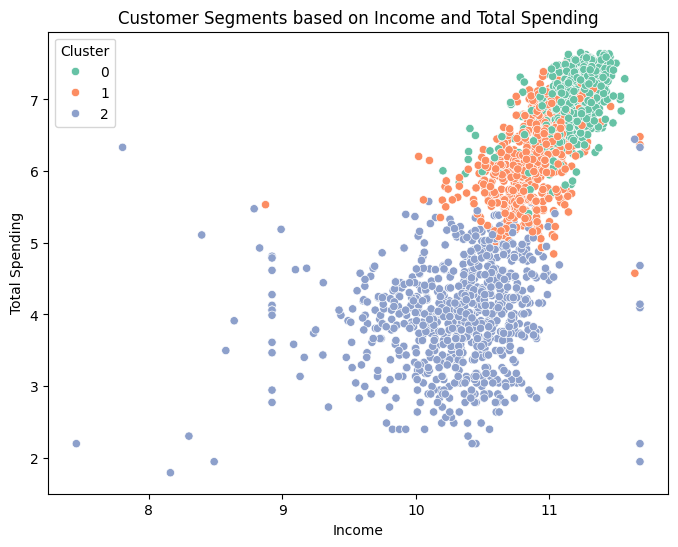
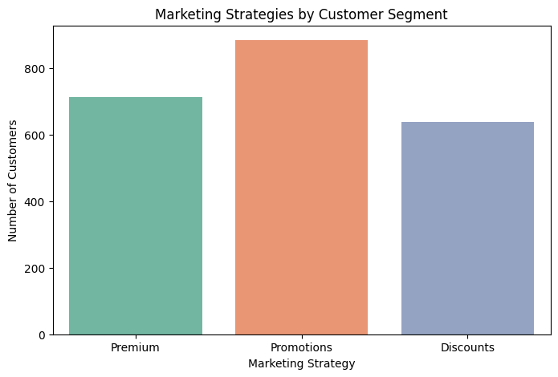

# Customer Segmentation and Purchase Prediction

## 📌 Project Overview

This project focuses on customer segmentation and purchase prediction using machine learning techniques. It combines K-Means clustering to identify customer groups and a Random Forest classifier to predict customer purchase behavior based on marketing customer data.

---

## 🛠 Technologies Used

- Python
- Pandas
- NumPy
- Scikit-learn
- Matplotlib
- Seaborn
- K-Means Clustering
- Random Forest Classifier
- StandardScaler
- KNN Imputer

---

## 🤖 Models Used

- K-Means Clustering
- Random Forest Classifier

---

## 📂 Dataset

The project uses a marketing customer dataset containing customer demographics, purchasing behavior, campaign responses, and spending information for customer segmentation and purchase prediction.

---

## 📁 Project Files

- `Customer_Segmentation_and_Purchase_Prediction.ipynb` – Complete notebook including preprocessing, clustering, model training, evaluation, and business insights.
- `marketing_campaign.csv` – Marketing customer dataset used in this project.

---

## 📊 Project Workflow

1. Data Cleaning
2. Exploratory Data Analysis (EDA)
3. Feature Engineering
4. Data Preprocessing
5. Data Scaling
6. Customer Segmentation using K-Means
7. Purchase Prediction using Random Forest
8. Model Evaluation
9. Business Insights

---

## 📈 Marketing Recommendation

Based on the customer segmentation results, the project recommends personalized marketing strategies for each customer segment to improve customer engagement and increase purchase performance.

---

## 📌 Key Insights

- Customers were successfully segmented into different behavioral groups using K-Means clustering.
- Random Forest achieved strong performance in predicting customer purchase behavior.
- Customer segmentation enables personalized marketing strategies.
- Premium customers respond better to exclusive offers.
- Promotion-focused customers are highly responsive to marketing campaigns.
- Discount-oriented customers are more price-sensitive and benefit from targeted discount campaigns.

---

## 🎯 Business Value

This project demonstrates how machine learning and customer analytics can support marketing teams by:

- Improving customer targeting.
- Increasing campaign effectiveness.
- Supporting personalized marketing.
- Enhancing customer engagement.
- Enabling data-driven business decisions.
